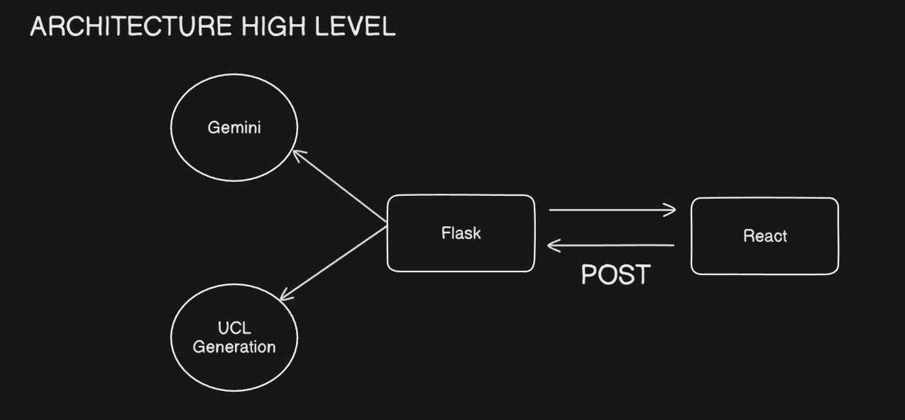

<!-- PROJECT SHIELDS -->
[![Contributors][contributors-shield]][contributors-url]
[![Forks][forks-shield]][forks-url]
[![Stargazers][stars-shield]][stars-url]
[![Issues][issues-shield]][issues-url]
[![MIT License][license-shield]][license-url]

<!-- PROJECT LOGO -->
<br />
<div align="center">
  <a href="https://github.com/Intenzi/UCL">
    
  </a>

  <h1 align="center">Universal Code Language (UCL)</h1>

  <p align="center">
    Revolutionizing codebase comprehension and context sharing.
    <br />
    <a href="https://github.com/Intenzi/UCL"><strong>Explore the docs »</strong></a>
    <br />
    <br />
    <a href="https://intenzi.dev/UCL">View Demo</a>
    &middot;
    <a href="https://github.com/Intenzi/UCL/issues/new?labels=bug&template=bug-report---.md">Report Bug</a>
    &middot;
    <a href="https://github.com/Intenzi/UCL/issues/new?labels=enhancement&template=feature-request---.md">Request Feature</a>
  </p>
  <p align="center">
    <strong>⭐ Star this repo if you like what you see!</strong>
  </p>
</div>

<!-- TABLE OF CONTENTS -->
<details>
  <summary>Table of Contents</summary>
  <ol>
    <li>
      <a href="#about-the-project">About The Project</a>
      <ul>
        <li><a href="#key-benefits">Key Benefits</a></li>
        <li><a href="#built-with">Built With</a></li>
      </ul>
    </li>
    <li>
      <a href="#how-ucl-works">How UCL Works</a>
      <ul>
        <li><a href="#frontend-integration">Frontend Integration</a></li>
        <li><a href="#backend-processing">Backend Processing</a></li>
      </ul>
    </li>
    <li>
      <a href="#getting-started">Getting Started</a>
      <ul>
        <li><a href="#prerequisites">Prerequisites</a></li>
        <li><a href="#installation">Installation</a></li>
      </ul>
    </li>
    <li><a href="#usage">Usage</a></li>
    <li><a href="#features">Features</a></li>
    <li><a href="#roadmap">Roadmap</a></li>
    <li><a href="#contributing">Contributing</a></li>
    <li><a href="#license">License</a></li>
    <li><a href="#contact">Contact</a></li>
    <li><a href="#acknowledgments">Acknowledgments</a></li>
  </ol>
</details>

<!-- ABOUT THE PROJECT -->
## About The Project


**Universal Code Language (UCL)** is a groundbreaking approach to codebase indexing and comprehension that transforms how developers understand and interact with unfamiliar code. 

In today's fast-paced development environment, engineers frequently need to understand large, complex codebases quickly. Traditional methods of code familiarization are time-consuming and inefficient, often requiring days or weeks to gain a comprehensive understanding.

UCL solves this problem by creating a standardized, semantic representation of any codebase that can be easily shared, understood, and integrated with modern AI tools. It serves as the ultimate bridge between human developers and machine understanding of code.

### Key Benefits

* **Dramatic Time Savings** - Reduce codebase familiarization from weeks to minutes by providing a comprehensive, structured overview that captures essential relationships and architecture
  
* **Cost Efficiency** - Lower onboarding costs for new team members and consultants by 70-90% through accelerated understanding of complex systems
  
* **Seamless LLM Integration** - Plug-and-play compatibility with AI tools through our standardized format, enabling instant context-aware responses about your code
  
* **Blazingly Fast Processing** - Sophisticated parsing tools and language-specific compilers compress even the largest codebases into our standardized format in minutes
  
* **Code Health Monitoring** - Track architecture evolution, identify technical debt, and maintain engineering best practices through automated analysis
  
* **Universal Compatibility** - Works with all major programming languages through our extensible Tree-sitter integration

### Built With

* [![Python][Python]][Python-url]
* [![React][React.js]][React-url]
* [![Flask][Flask]][Flask-url]
* [![Tree-sitter][Tree-sitter]][Tree-sitter-url]
* [![Gemini API][Gemini]][Gemini-url]

<p align="right">(<a href="#readme-top">back to top</a>)</p>

<!-- HOW UCL WORKS -->
## How UCL Works

UCL operates through a sophisticated pipeline that analyzes codebases across multiple dimensions to create a comprehensive, standardized representation.

### Frontend Integration



The UCL frontend provides an intuitive interface for:
- Uploading and managing codebases
- Visualizing code relationships and architecture
- Querying the codebase using natural language
- Tracking code health metrics over time
- Exporting UCL files for sharing with team members

### Backend Processing


The UCL backend performs the heavy lifting:
1. **Parsing** - Tree-sitter analyzes the syntax and structure of each file
2. **Semantic Analysis** - Language-specific compilers extract relationships between components
3. **Context Building** - AI integration provides natural language summaries and relationships
4. **Standardization** - All information is compiled into our universal UCL format
5. **Indexing** - The UCL file is optimized for rapid querying and integration

<p align="right">(<a href="#readme-top">back to top</a>)</p>

<!-- GETTING STARTED -->
## Getting Started

Setting up UCL involves both backend and frontend components. Follow these instructions to get a local copy up and running.

### Prerequisites

* Python 3.8+ (3.8 specifically required for Gemini API integration)
* Node.js and npm
* Git

### Installation

#### Backend Setup

1. Clone the repository
   ```sh
   git clone https://github.com/Intenzi/UCL.git
   cd ucl/server
   ```

2. Install Python dependencies
   ```sh
   pip install requirements.txt
   ```

3. For Gemini API integration (optional but recommended)
   ```sh
   pip install git+https://github.com/jstmn/generative-ai-python-3.8
   ```

4. Run the UCL server
   ```sh
   python uclserver.py
   ```
   
   Or for backend-only processing:
   ```sh
   python ucl.py
   ```

#### Frontend Setup

1. Navigate to the frontend directory
   ```sh
   cd frontend
   ```

2. Install NPM packages
   ```sh
   npm install
   ```

3. Start the development server
   ```sh
   npm run dev
   ```

<p align="right">(<a href="#readme-top">back to top</a>)</p>

<!-- USAGE EXAMPLES -->
## Usage

UCL simplifies codebase comprehension through several key workflows:

### Generating UCL Files via Tkinter GUI

```sh
python gui.py
```

### Querying a Codebase via CLI

```sh
python ucl.py --query "How does the authentication system work?" --context codebase.ucl
```

### Web Interface

Access the full UCL experience by visiting `http://localhost:5173/UCL` after starting both the backend server and frontend client.


### Integration with LLMs

Simply paste your UCL file into any LLM conversation:

```
[Paste UCL file content here]

Based on this codebase, explain how the data flows from the frontend to the database.
```

<p align="right">(<a href="#readme-top">back to top</a>)</p>

<!-- FEATURES -->
## Features

### Codebase Comprehension
- Full semantic understanding of code structure
- Relationship mapping between components
- Natural language summaries of functionality

### Developer Experience
- Rapid onboarding for new team members
- Instant answers to architectural questions
- Reduced context-switching costs

### Code Health
- Technical debt identification
- Architecture drift monitoring
- Complexity analysis
- Best practice enforcement

### Integration Capabilities
- Compatible with all major LLMs
- API for CI/CD pipeline integration
- IDE plugins and MCP Integration (coming soon)

<p align="right">(<a href="#readme-top">back to top</a>)</p>

<!-- ROADMAP -->
## Roadmap

- [x] Core UCL format specification
- [x] Tree-sitter integration for parsing
- [x] Basic web interface
- [x] Gemini API integration
- [ ] Support for additional languages
  - [x] JavaScript/TypeScript
  - [x] Python
  - [x] Java
  - [ ] C/C++
  - [ ] Go
- [ ] IDE plugins
- [ ] CI/CD integration
- [ ] Enterprise features

See the [open issues](https://github.com/Intenzi/UCL/issues) for a full list of proposed features and known issues.

<p align="right">(<a href="#readme-top">back to top</a>)</p>

<!-- CONTRIBUTING -->
## Contributing

Contributions are what make the open source community such an amazing place to learn, inspire, and create. Any contributions you make are **greatly appreciated**.

If you have a suggestion that would make this better, please fork the repo and create a pull request. You can also simply open an issue with the tag "enhancement".
Don't forget to give the project a star! Thanks again!

1. Fork the Project
2. Create your Feature Branch (`git checkout -b feature/AmazingFeature`)
3. Commit your Changes (`git commit -m 'Add some AmazingFeature'`)
4. Push to the Branch (`git push origin feature/AmazingFeature`)
5. Open a Pull Request

<p align="right">(<a href="#readme-top">back to top</a>)</p>

<!-- LICENSE -->
## License

Distributed under the Unlicense License. See `LICENSE.txt` for more information.

<p align="right">(<a href="#readme-top">back to top</a>)</p>

<!-- CONTACT -->
## Contact

Ritvik - [@intenzi](https://discord.com/users/296937641121939456) - intenzisenpai@gmail.com

Project Link: [https://github.com/Intenzi/UCL](https://github.com/Intenzi/UCL)

<p align="right">(<a href="#readme-top">back to top</a>)</p>

<!-- ACKNOWLEDGMENTS -->
## Acknowledgments

* [Tree-sitter](https://tree-sitter.github.io/tree-sitter/) for their amazing parsing library
* [Google Gemini](https://ai.google.dev/) for AI integration capabilities
* [React](https://reactjs.org/) for frontend framework
* [Flask](https://flask.palletsprojects.com/) for API server
* [All Contributors](https://github.com/Intenzi/UCL/graphs/contributors) who have helped shape UCL

<p align="right">(<a href="#readme-top">back to top</a>)</p>

<!-- MARKDOWN LINKS & IMAGES -->
<!-- https://www.markdownguide.org/basic-syntax/#reference-style-links -->
[contributors-shield]: https://img.shields.io/github/contributors/Intenzi/UCL.svg?style=for-the-badge
[contributors-url]: https://github.com/Intenzi/UCL/graphs/contributors
[forks-shield]: https://img.shields.io/github/forks/Intenzi/UCL.svg?style=for-the-badge
[forks-url]: https://github.com/Intenzi/UCL/network/members
[stars-shield]: https://img.shields.io/github/stars/Intenzi/UCL.svg?style=for-the-badge
[stars-url]: https://github.com/Intenzi/UCL/stargazers
[issues-shield]: https://img.shields.io/github/issues/Intenzi/UCL.svg?style=for-the-badge
[issues-url]: https://github.com/Intenzi/UCL/issues
[license-shield]: https://img.shields.io/github/license/Intenzi/UCL.svg?style=for-the-badge
[license-url]: https://github.com/Intenzi/UCL/blob/master/LICENSE.txt

[Python]: https://img.shields.io/badge/python-3670A0?style=for-the-badge&logo=python&logoColor=ffdd54
[Python-url]: https://python.org/
[React.js]: https://img.shields.io/badge/React-20232A?style=for-the-badge&logo=react&logoColor=61DAFB
[React-url]: https://reactjs.org/
[Flask]: https://img.shields.io/badge/flask-%23000.svg?style=for-the-badge&logo=flask&logoColor=white
[Flask-url]: https://flask.palletsprojects.com/
[Tree-sitter]: https://img.shields.io/badge/Tree--sitter-black?style=for-the-badge
[Tree-sitter-url]: https://tree-sitter.github.io/tree-sitter/
[Gemini]: https://img.shields.io/badge/Gemini-8E75B2?style=for-the-badge&logo=google&logoColor=white
[Gemini-url]: https://ai.google.dev/
